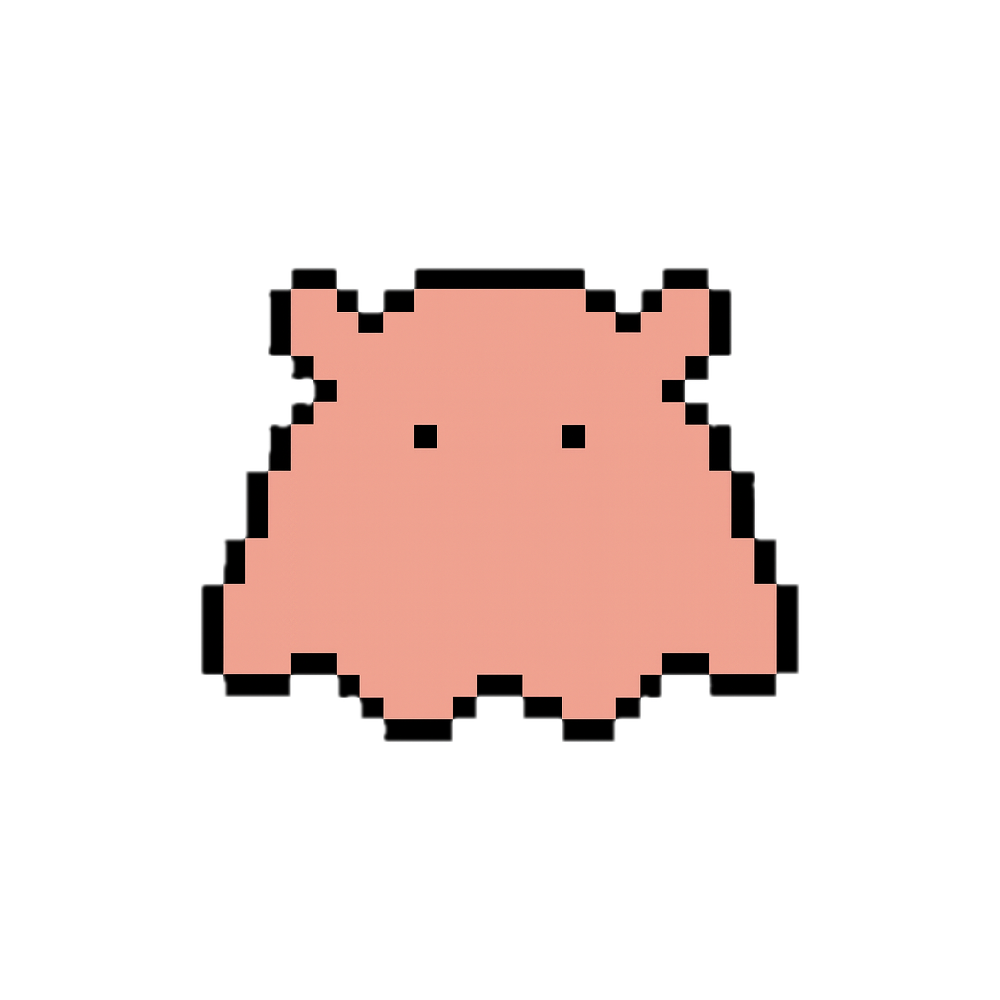

# @sigrea/core

<p align="center">
  
</p>

Sigrea is a small reactive core built on [alien-signals](https://github.com/stackblitz/alien-signals).
It adds deep reactivity and scope-based lifecycles, and exposes the primitives
needed to build hooks.

- **Core primitives.** `signal`, `computed`, `toSignal`, `deepSignal`, `watch`, and `watchEffect`.
- **Lifecycles.** `Scope`, `onMount`, and `onUnmount` for cleanup boundaries.
- **Molecules.** `molecule()` is a lifecycle container that doesn't render UI.
- **Composition.** Build molecule trees via `get()`.
- **Testing.** `trackMolecule` + `disposeTrackedMolecules` helps reproduce lifecycles in tests.

Inspired by:
- [Vue 3](https://vuejs.org/) — deep reactivity and scope control
- [nanostores](https://github.com/nanostores/nanostores) — store-centric architecture
- [bunshi](https://github.com/saasquatch/bunshi) — molecule concepts and `get()`-based parent-child graph design

## Table of Contents

- [Install](#install)
- [Adapters](#adapters)
- [Quick Start](#quick-start)
- [Hooks](#hooks)
- [Molecules](#molecules)
- [Testing](#testing)
- [Handling Scope Cleanup Errors](#handling-scope-cleanup-errors)
- [Development](#development)
- [License](#license)

## Install

```bash
npm install @sigrea/core
```

## Adapters

Official adapters connect Sigrea molecules and signals to UI frameworks:

- **[@sigrea/vue](https://github.com/sigrea/vue)** — Vue 3.4+ composables (`useMolecule`, `useSignal`, `useMutableSignal`, `useDeepSignal`)
- **[@sigrea/react](https://github.com/sigrea/react)** — React 18+ hooks (`useMolecule`, `useSignal`, `useComputed`, `useDeepSignal`)

Each adapter binds molecule lifecycles to component lifecycles and synchronizes signal subscriptions with the framework's reactivity system.

## Quick Start

### Signals and Computed

```ts
import { computed, signal } from "@sigrea/core";

const count = signal(1);
const doubled = computed(() => count.value * 2);

count.value = 3;
console.log(doubled.value); // 6
```

## Hooks

Hooks are plain functions built from the core primitives.
This package does not include UI bindings.
In UI apps, you usually call hooks inside a molecule.
Then connect the molecule to the UI layer via an adapter.
`watch()` and `watchEffect()` return callable stop handles with `pause()` and
`resume()` methods.

### Example: state + actions

```ts
import { computed, readonly, signal } from "@sigrea/core";

export function useCounter(initial = 0) {
  const count = signal(initial);
  const doubled = computed(() => count.value * 2);

  const increment = () => {
    count.value++;
  };

  const decrement = () => {
    count.value--;
  };

  return {
    count: readonly(count),
    doubled,
    increment,
    decrement,
  };
}
```

### Example: deepSignal for nested state

```ts
import { computed, deepSignal } from "@sigrea/core";

export function useUserProfile() {
  const profile = deepSignal({
    name: "Mendako",
    address: { city: "Tokyo" },
  });

  const label = computed(() => {
    return `${profile.name} @ ${profile.address.city}`;
  });

  const setCity = (city: string) => {
    profile.address.city = city;
  };

  return {
    profile,
    label,
    setCity,
  };
}
```

## Molecules

`molecule(setup)` creates a function.
Calling the returned factory creates a new instance with its own root `Scope`.
It does not render anything.
Use molecules when you need:

- a clear ownership + cleanup boundary (`Scope`, `onUnmount`),
- parent-child relationships between lifecycled units (`get()`),
- parent-driven inputs via props.

Props passed to `setup` are stable, shallow readonly, and reactive at the top
level. Official adapters keep them in sync with component props. If you use core
directly, call `updateMoleculeProps(instance, nextProps)` to replace them.

Read props through `props.propName`. Destructuring a prop value copies the
current value and loses reactivity. Use `toSignal(props, "propName")` only when
an internal helper needs a prop-shaped `ReadonlySignal`; do not return prop
mirrors from a molecule just because a prop is reactive.

The props object must be a plain object. Sigrea syncs enumerable top-level
properties and passes nested values as-is.

Molecule setup declares state and registers lifecycle hooks.
When `onMount`, `onUnmount`, `watch`, or `watchEffect` are called during setup,
their work is deferred until the molecule is mounted.
Official adapters mount and unmount molecules automatically.
If you use the core package directly, call `mountMolecule()` and `unmountMolecule()`.

Inside `setup`, you can call hooks or use the core primitives directly.
Child molecules are internal dependencies—prefer returning only the outputs
(signals, computed values, actions) that consumers need.

### Controlled values with a controller molecule

This example uses `createEvents` from `@sigrea/use`.

```ts
import {
  computed,
  get,
  molecule,
  readonly,
  signal,
  toSignal,
} from "@sigrea/core";
import { createEvents } from "@sigrea/use";

interface DialogProps {
  open: boolean;
  disabled?: boolean;
}

type DialogEvents = {
  "update:open": [next: boolean];
};

const DialogMolecule = molecule<DialogProps>((props) => {
  const { send, on } = createEvents<DialogEvents>();
  const isOpen = toSignal(props, "open");
  const isDisabled = computed(() => props.disabled ?? false);

  const emitOpenChange = async (next: boolean) => {
    if (isDisabled.value || isOpen.value === next) {
      return;
    }
    await send("update:open", next);
  };

  const open = () => {
    return emitOpenChange(true);
  };

  const close = () => {
    return emitOpenChange(false);
  };

  const toggle = () => {
    return emitOpenChange(!isOpen.value);
  };

  return {
    on,
    open,
    close,
    toggle,
  };
});

const DialogControllerMolecule = molecule(() => {
  const isOpen = signal(false);
  const dialog = get(DialogMolecule, () => ({
    open: isOpen.value,
  }));

  dialog.on("update:open", (next) => {
    isOpen.value = next;
  });

  return {
    isOpen: readonly(isOpen),
    open: dialog.open,
    close: dialog.close,
    toggle: dialog.toggle,
  };
});
```

This pattern keeps the controlled value in a parent or controller molecule. The
child molecule reads props internally and sends `update:open` when it wants its
owner to replace the value. Framework adapters mount the controller molecule.
Components read the controller-owned signals and computed values it returns; raw
molecule events stay inside the molecule graph.

### Composing molecules with `get()`

```ts
import { computed, get, molecule } from "@sigrea/core";

interface TabItemProps {
  selectedId: string;
  id: string;
}

const TabItemMolecule = molecule<TabItemProps>((props) => {
  const isSelected = computed(() => props.selectedId === props.id);

  return {
    isSelected,
  };
});

interface TabsProps {
  selectedId: string;
  itemId: string;
}

const TabsMolecule = molecule<TabsProps>((props) => {
  const item = get(TabItemMolecule, () => ({
    id: props.itemId,
    selectedId: props.selectedId,
  }));

  return {
    isItemSelected: item.isSelected,
  };
});
```

Notes:

- Use `computed()` for derived state. Use `toSignal(props, "key")` only when an
  internal helper needs a signal view of a prop, not as a default return shape.
- Use `get()` to create and own child molecule instances.
- `get()` must be called synchronously during molecule setup.
- `get(Child, props)` passes a static props snapshot. Use
  `get(Child, () => ({ ... }))` to derive child props reactively from parent
  props. The child instance is not recreated when live props change.
- Props sync is top-level only. Nested objects are passed through as values;
  replace the top-level prop when a nested value must notify dependents.
- `onUnmount()` callbacks and `watch()` effects are tied to the mount lifecycle.
- `watch()` and `watchEffect()` return callable stop handles; calling a handle
  directly is equivalent to calling `handle.stop()`, and each handle also
  exposes `handle.pause()` and `handle.resume()`.
- `handle.pause()` suspends only that watcher. Calling it does not run cleanup
  callbacks or dispose the current scope; if changes happened while paused,
  `handle.resume()` runs once with the latest value when needed.
- `handle.pause()` / `handle.resume()` are separate from `pauseTracking()` /
  `resumeTracking()`, which control dependency collection while code runs.
- Child molecules created via `get()` are disposed with their parent.

## Testing

```ts
// tests/CounterMolecule.test.ts
import { afterEach, expect, it } from "vitest";

import {
  disposeTrackedMolecules,
  molecule,
  readonly,
  signal,
  trackMolecule,
} from "@sigrea/core";

afterEach(() => disposeTrackedMolecules());

it("increments and exposes derived state", () => {
  const CounterMolecule = molecule(() => {
    const count = signal(10);

    const increment = () => {
      count.value++;
    };

    return {
      count: readonly(count),
      increment,
    };
  });

  const counter = CounterMolecule();
  trackMolecule(counter);
  counter.increment();

  expect(counter.count.value).toBe(11);
});
```

## Handling Scope Cleanup Errors

Cleanup callbacks run when a scope is disposed.
If a cleanup throws, Sigrea collects errors into an `AggregateError`.

Async cleanups are not awaited.
If an async cleanup rejects, Sigrea forwards the error to the handler (if any).
In dev, Sigrea also logs the rejection.

Use `setScopeCleanupErrorHandler` to customize error handling.
This is useful for logging or reporting to monitoring services.

```ts
import { setScopeCleanupErrorHandler } from "@sigrea/core";

setScopeCleanupErrorHandler((error, context) => {
  console.error(`Cleanup failed:`, error);

  // Forward to monitoring service
  if (typeof Sentry !== "undefined") {
    Sentry.captureException(error, {
      tags: { scopeId: context.scopeId, phase: context.phase },
    });
  }
});
```

The handler receives `error` and `context`.
`context` includes `scopeId`, `phase`, `index`, and `total`.

Return `ScopeCleanupErrorResponse.Suppress` to prevent the error from being thrown.
Return `ScopeCleanupErrorResponse.Propagate` to rethrow immediately for synchronous errors.

## Development

This repo targets Node.js 24 or later.

### Browser dev flag

Some dev-only diagnostics are guarded by `__DEV__`.
In Node.js, Sigrea uses `process.env.NODE_ENV !== "production"`.

In browsers, you can override this at build time by defining a global constant
`__SIGREA_DEV__` with your bundler.
If you don't define it, `__DEV__` defaults to `false` in browsers.

Vite example:

```ts
// vite.config.ts
import { defineConfig } from "vite";

export default defineConfig(({ command }) => ({
  define: {
    __SIGREA_DEV__: command === "serve",
  },
}));
```

If you use mise:

- `mise trust -y` — trust `mise.toml` (first run only).
- `pnpm -s cicheck` — run CI-equivalent checks locally.
- `mise run notes` — preview release notes (optional).

You can also run pnpm scripts directly:

- `pnpm install` — install dependencies.
- `pnpm test` — run tests.
- `pnpm typecheck` — run TypeScript type checking.
- `pnpm test:coverage` — collect coverage.
- `pnpm build` — build the package.
- `pnpm -s cicheck` — run CI checks locally.

See [CONTRIBUTING.md](./CONTRIBUTING.md) for workflow details.

## License

MIT — see [LICENSE](./LICENSE).
